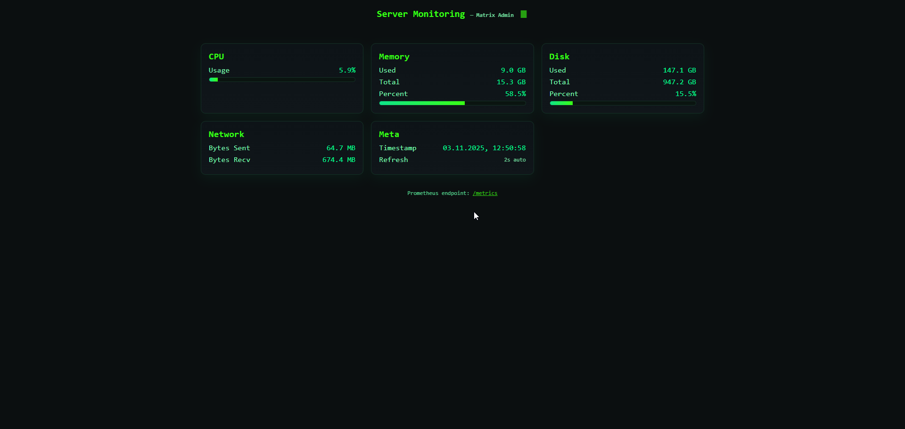

# Server Monitoring

Server Monitoring API на FastAPI, отдаёт системные метрики и экспортирует их в формате Prometheus.

Стек
- FastAPI — HTTP API.
- psutil — сбор системных метрик (CPU/RAM/Disk/Net).
- prometheus-client — экспорт метрик на `/metrics`.
- uvicorn — dev‑сервер.
- Prometheus — сбор метрик.
- Grafana — визуализация панелей.

Быстрый старт
1. Запуск приложения:
   - `./run.ps1` — создаст venv, поставит зависимости и запустит на `127.0.0.1:8015`.
   - Эндпоинты:
     - `GET /health` — проверка здоровья.
     - `GET /metrics/json` — JSON‑снимок метрик (CPU/RAM/Disk/Net).
     - `GET /metrics` — экспорт метрик для Prometheus.
2. Запуск Prometheus + Grafana (Docker):
   - Установите Docker Desktop.
   - Перейдите в каталог `projects/server-monitoring` и выполните: `docker compose up -d`.
   - Prometheus: `http://localhost:9090` (собирает с `host.docker.internal:8015`).
   - Grafana: `http://localhost:3000` (логин `admin`, пароль `admin`).
   - В Grafana добавьте источник данных Prometheus: URL `http://prometheus:9090`.
   - Создайте графики по метрикам `server_cpu_percent`, `server_mem_used_bytes`, `server_disk_used_bytes`, `server_net_bytes_sent_total`, `server_net_bytes_recv_total`.

Roadmap
- См. `ROADMAP.md` (RU) и `ROADMAP.en.md` (EN) — план на 2024 по кварталам.

Документация
- Дорожные карты доступны на двух языках: RU/EN.
 
Примечания
- На Linux вместо `host.docker.internal` используйте IP хоста для Docker, например `172.17.0.1`.
